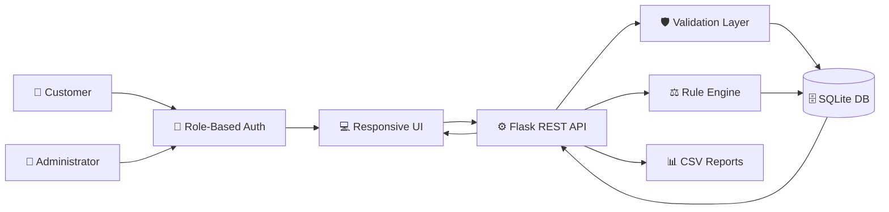
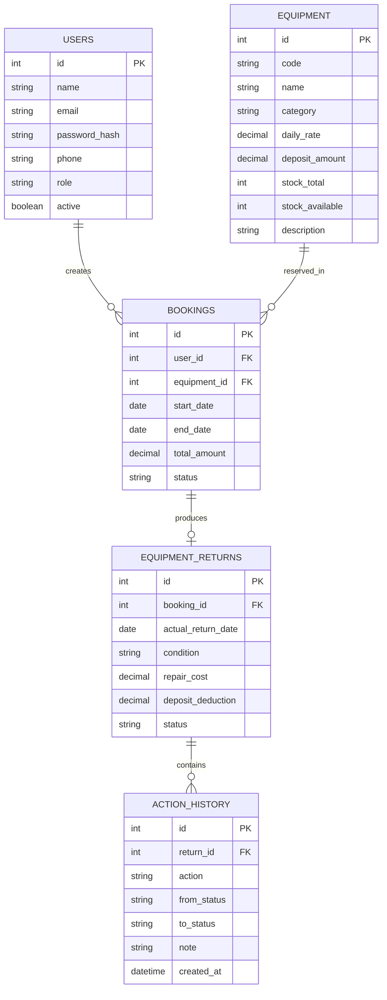

# 📦 Equipment Return & Damage Tracker

A state-of-the-art, role-based rental operations management platform engineered for **SD Digitals**. Designed to bridge the gap between customers and rental operations teams, this application digitizes the entire lifecycle of booking equipment, tracking active rentals, handling returns, inspecting item conditions, managing security deposits, and processing damage claims with full audit trails.

---

## 🚀 Portals & Quick Credentials

The system provides dedicated portals for different roles with clear security isolation. Below are the default credentials for evaluation.

| Portal | Role Target | Default Username | Default Password | Entry Point |
| :--- | :--- | :--- | :--- | :--- |
| **User Portal** | Customers & Rental Clients | `user@sd-digitals.com` | `User@123` | [`/user`](http://127.0.0.1:5001/user) |
| **Admin Portal** | Operations Team & Directors | `admin@sd-digitals.com` | `Admin@123` | [`/admin`](http://127.0.0.1:5001/admin) |

> [!NOTE]
> New customers can register directly on the login screen using the **Create account** interface. Existing accounts can reset their passwords using the **Forgot password** flow which triggers a secure OTP.

---

## 🎨 Application Architecture & Database Model

### System Architecture
The application runs on a clean Flask REST API backed by a secure relational SQLite database.



### Entity-Relationship Diagram
The database schema tracks equipment lifecycle status and maintains a permanent, timestamped action history log for all return processing steps.



---

## ⚖️ Business & Workflow Rules

To ensure transparent operations, the platform enforces automated rules for return inspections and security deposit refunds:

1. **Overdue Tracking**: Any booking that is active and goes past its scheduled return date is automatically flagged as **Overdue** on the dashboard.
2. **Clean Returns**: If returned equipment is inspected and found to be in `Excellent`, `Good`, or `Fair` condition with `repair_cost = 0`, the return is closed and the held security deposit is automatically queued for full refund.
3. **Damaged Returns**: Equipment returned in `Damaged` condition or with any `repair_cost > 0` triggers a `claim_pending` state, shifting the record into the Admin Claim Workspace.
4. **Lost Equipment**: Equipment reported as `Lost` automatically prompts full forfeiture of the security deposit.
5. **Deduction Capping**: Security deposit deductions are capped at the *lower* of the actual repair cost or the total security deposit held. Deductions can *never* exceed the deposit amount.
6. **Immutable Log**: Every creation, status transition, and inspection triggers a detailed log in the **Action History** that remains permanently linked to the record.

---

## 💎 Features Checklist

### 👥 Customer Experience (User Portal)
* **Visual Dashboard**: Instant metrics on total rentals, active rentals, pending approvals, and returned items.
* **Smart Equipment Catalogue**: Interactive search-only equipment gallery displaying daily rental rates, security deposits, and live stock availability.
* **Return Request Engine**: Fast digital submittal to request returns for active rentals.
* **Statements & Ledger**: Interactive list showing full breakdowns of rental amounts, deposit cuts, and refund balances.
* **Profile Management**: Update contact information (name, phone) on the fly.

### 👑 Operations & Audit Workspace (Admin Portal)
* **Operational Dashboard**: Financial snapshots including repair exposure, deposit deductions, available units, and overdue counts.
* **Inventory Control**: Live tools to add, edit, and audit equipment specs, deposit caps, and stock.
* **Customer Registry**: View customer list, track individual rental counts, and enable/disable customer log-ins.
* **Inspection Workflow**: Process returns, record condition ratings (`Excellent`, `Good`, `Fair`, `Damaged`, `Lost`), log remarks, and input repair costs.
* **Claims Management**: Approve, adjust, or resolve proposed security deposit deductions.
* **Exportable Reporting**: Live tables with a direct **CSV Export** downloading a full audit sheet of returns and financials.

---

## 🛠️ Getting Started & Local Setup

### System Prerequisites
Ensure you have **Python 3.8+** installed on your workstation.

### 1. Installation & Environment Setup
Open your terminal in the project root directory and run:
```powershell
# Create virtual environment
python -m venv .venv

# Activate virtual environment
# Windows (PowerShell):
.venv\Scripts\Activate.ps1
# macOS/Linux:
source .venv/bin/activate

# Install dependencies
pip install -r requirements.txt
```

### 2. Database Initialization (Seeding)
Initialize the SQLite database with seed data:
```powershell
python -m flask --app backend.app seed
```

### 3. Start the Server
Run the Flask application server locally:
```powershell
python run.py
```
The application will launch on **`http://127.0.0.1:5001`**.

---

## 📧 SMTP & Email OTP Setup

For secure production settings, password recovery OTPs are transmitted via SMTP.

1. Rename `.env.example` to `.env` in the root folder.
2. Open `.env` and fill in your mail server configuration parameters:
   ```env
   SMTP_HOST=smtp.gmail.com
   SMTP_PORT=587
   SMTP_USER=your_email@gmail.com
   SMTP_PASSWORD=your_app_specific_password
   SMTP_FROM=your_email@gmail.com
   SMTP_USE_TLS=True
   ```
3. Save the file and restart the server.

> [!TIP]
> If no SMTP values are configured, the application runs in **local testing mode**, and password reset OTPs are securely displayed directly on screen in the login interface.

---

## 🧪 Running Automated Tests

A comprehensive unit testing suite is included to guarantee reliability:
```powershell
python -m unittest discover -s tests -v
```
The suite verifies authentication rules, access permissions, stock deductions, inspection workflows, claims approval, and CSV generation.

---

## 📁 Directory Structure

```text
├── backend/                  # Flask REST API, authentication & databases
│   ├── app.py                # Server initialization & API Endpoints
│   ├── schema.sql            # Database schema definitions
│   └── __init__.py           # Package setup
├── frontend/                 # Client UI
│   ├── static/               # CSS styles, assets, & Client-side logic (app.js)
│   └── templates/            # HTML structural interfaces
├── tests/                    # Automated testing suite
├── docs/                     # Full project documentations & reports
└── data/                     # SQLite databases generated at runtime
```
